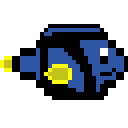

[![Contributors][contributors-shield]][contributors-url]
[![Stargazers][stars-shield]][stars-url]
[![Issues][issues-shield]][issues-url]
[![LinkedIn][linkedin-shield]][linkedin-url]
<!-- [![MIT License][license-shield]][license-url]
     [![Forks][forks-shield]][forks-url] -->


<!-- PROJECT LOGO -->
<br />
<div align="center">
  <a href="https://github.com/Multipixels/SelFISH">
    
  </a>

<h3 align="center">SelFISH</h3>

  <p align="center">
    A game made for the <a href="https://itch.io/jam/gdl-fishing-jam">GDL - Fishy Jam</a>
  </p>
</div>


<!-- TABLE OF CONTENTS -->
<details>
  <summary>Table of Contents</summary>
  <ol>
    <li>
      <a href="#about-the-project">About The Project</a>
      <ul>
        <li><a href="#built-with">Built With</a></li>
      </ul>
    </li>
    <li>
      <a href="#getting-started">Getting Started</a>
      <ul>
        <li><a href="#prerequisites">Prerequisites</a></li>
        <li><a href="#installation">Installation</a></li>
      </ul>
    </li>
    <!--<li><a href="#license">License</a></li>-->
    <li><a href="#contact">Contact</a></li>
  </ol>
</details>


<!-- ABOUT THE PROJECT -->
## About The Project

<!--[![Product Name Screen Shot][product-screenshot]](https://example.com)-->

A game made for the [GDL - Fishy Jam](https://itch.io/jam/gdl-fishing-jam).
It's an interactive five minute story game about a fish who's captured and put into a fish bowl.

It was made over the span of three days, with the main theme of the game jam being to include Fishing in one way or another.

<div align="center">

</div>


<p align="right">(<a href="#top">back to top</a>)</p>


### Built With

* [Unity](https://unity.com/)

<p align="right">(<a href="#top">back to top</a>)</p>


<!-- GETTING STARTED -->
## Getting Started

To get a local copy up and running follow these steps.

### Prerequisites

* [Unity 2019.1.0f2](https://unity3d.com/get-unity/download/archive#:~:text=Unity%20Hub-,Unity%202019.1.0,-15%20Apr%2C%202019)

### Source Code
* To get a copy of the source code, simply clone the repository and open it up in Unity.
   ```sh
   git clone https://github.com/Multipixels/SelFISH.git
   ```

### Installation

* You can either build the game using the source code and Unity, or download the release version from GitHub Releases [here](https://github.com/Multipixels/SelFISH/releases) or from the [itch](https://multipixels.itch.io/selfish) page.
  * The Itch page will also contain a WebGL build playable in the browser.

<p align="right">(<a href="#top">back to top</a>)</p>

<!-- LICENSE -->
<!-- ## License
Distributed under the MIT License. See `LICENSE.txt` for more information.
<p align="right">(<a href="#top">back to top</a>)</p> -->

<!-- CONTACT -->
## Contact

Richard Motorgeanu - richard.motorgeanu@gmail.com

Project Link: [https://github.com/Multipixels/SelFISH](https://github.com/Multipixels/SelFISH)

Itch.io Page: [https://multipixels.itch.io/selfish](https://multipixels.itch.io/selfish)

<p align="right">(<a href="#top">back to top</a>)</p>


<!-- MARKDOWN LINKS & IMAGES -->
<!-- https://www.markdownguide.org/basic-syntax/#reference-style-links -->
[contributors-shield]: https://img.shields.io/github/contributors/Multipixels/Keep-Talking-and-Nobody-Explodes-Bot.svg?style=for-the-badge
[contributors-url]: https://github.com/Multipixels/SelFISH/graphs/contributors
[forks-shield]: https://img.shields.io/github/forks/Multipixels/SelFISH.svg?style=for-the-badge
[forks-url]: https://github.com/Multipixels/SelFISH/network/members
[stars-shield]: https://img.shields.io/github/stars/Multipixels/SelFISH.svg?style=for-the-badge
[stars-url]: https://github.com/Multipixels/SelFISH/stargazers
[issues-shield]: https://img.shields.io/github/issues/Multipixels/SelFISH.svg?style=for-the-badge
[issues-url]: https://github.com/Multipixels/SelFISH/issues
<!-- [license-shield]: https://img.shields.io/github/license/github_username/repo_name.svg?style=for-the-badge -->
<!-- [license-url]: https://github.com/github_username/repo_name/blob/master/LICENSE.txt -->
[linkedin-shield]: https://img.shields.io/badge/-LinkedIn-black.svg?style=for-the-badge&logo=linkedin&colorB=555
[linkedin-url]: https://www.linkedin.com/in/richard-motorgeanu/
[product-screenshot]: images/screenshot.png
